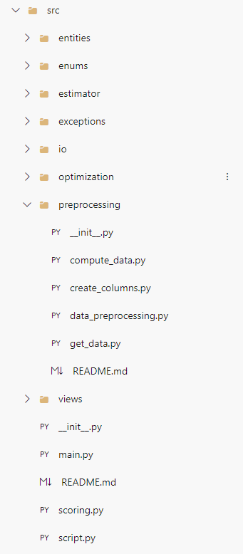

# Introduction 
This template provides a common structure for the solutions used by the data science team, aiming to facilitate the initialization of new projects.

# Installing procedures ``pip install``
> **Note** We are going to use `bash` terminal on all commands. If you don't have it, install [git](https://git-scm.com/downloads). ⚠️**Some commands will not work on ``cmd``.**

First, you will need to install `cookiecutter` which is the tool we using to manage this template:
``pip install cookiecutter``

After the installation, but before the initialization of the project, you might want to have all the necessary information at hand:
1. `repo_name` The name of the folder that will be created. (default = 'dsproject')
2. `pc_user_name`Your username on your computer, usually `first_name.last_name`. (default = 'first_name.last_name')
3. `USER_ID` Your user id collected from the command ```id``` on the bash terminal.  (default = 0)
4. `USER_GROUP_ID` Your user group id collected from the command ```id``` on the bash terminal.  (default = 0)
> **Note:** You don't need to fill the `USER_ID` and `USER_GROUP_ID` at the creation, you can later update these values inside the path `'repo_name/env/.env'`. (`repo_name` is the name you chose for the folder).

Once you have gathered all the necessary information, you will execute the command ```cookiecutter https://github.com/devthauan/DSTemplate ```. This action will initiate the creation of the project, prompting the user to either provide the requested information or press Enter to accept the default values.

## Folder organization

```
project
└───data
    │   data.json
└───docs
    │   procedure.md
└───env
    │   .dockerignote
    │   .env
    │   conda_environment.yml
    │   create_env_azureml.py
    │   docker-compose.yml
    │   Dockerfile    
└───notebooks
    │   import_hello_world.ipynb
└───pipelines
    │   pipeline.yml
└───src
|   │    __init__
│   └───modules
│       │   __init__
│       └───examples
│       │   │   __init__
│       │   │   hello_world.py

└───tests
│   └───examples
│       │   __init__
│       │   test_hello_world.py
│   .devcontainer.json
|   .gitignore
|   README.md
```

## Modules
We encourage the use of modules on the construction of the `src` folder to enhance code organization and maintainability.
